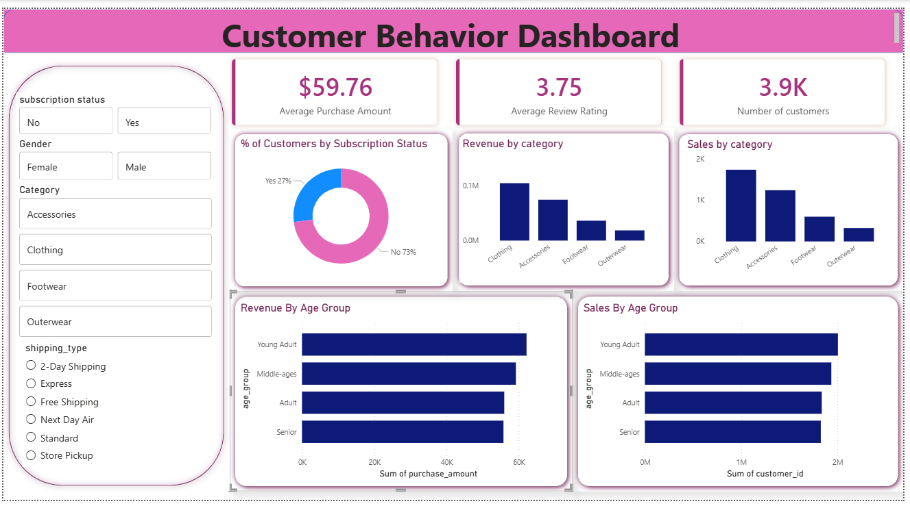

Data Analytics Project

Customer_Behavior_Analysis

Overview

This project demonstrates an end-to-end data analytics workflow, starting from loading a dataset in python, performing exploratory data analysis (EDA), cleaning and transforming the data, running SQL queries on relational databases, bulding a Power BI dashboard, and finaaly creating a structured report and presntation using Gamma. 

The goal is to shocase strong problem-solving, analytical, visulatization skills that are crucial for data-drievn decision-making.

Dataset

The dataset contains structured business data used for analysis and visualization.

Key Information:
Format: MS Excel (.xlsx)
Records: 3900 rows
Features: 18 columns

Tools & Technologies

Python(Pandas, NumPy, Matplotlib, Seaborn) – Data loading, cleaning, and exploratory data analysis (EDA)
MySQL – Data querying and analysis
Power BI – Interactive dashboard creation
Gamma – Presentation (PPT) development
Microsoft Word / PDF – Project reporting
Github - Version control and project sharing

Project Workflow

1. Data Loading
Imported the dataset into Python.
Examined data structure, data types, and summary statistics.

2. Exploratory Data Analysis (EDA)
Analyzed distributions and trends.
Identified patterns, correlations, and potential issues.
Created visualizations to understand the data.

3. Data Cleaning
Handled missing values.
Removed duplicate records.
Corrected inconsistent data formats.
Prepared data for analysis.

4. SQL queries
Imported cleaned data into MySQL.
Wrote SQL queries to answer business questions(joins, aggregations, filtering)
Validated analysis against Python results

5. Dashboard Development
Connected data to Power BI.
Designed interactive visualizations and KPIs.
Built dashboards for business insights and decision-making.

7. Reporting & Presentation (Gamma)
Documented methodology, findings, and recommendations.
Created a professional project report.
Developed a presentation using Gamma to communicate key insights.

Dashboard

The Power BI dashboard includes:

Key Performance Indicators (KPIs)
Trend Analysis
Category-wise Performance
Interactive Filters and Slicers
Summary Insights

Dashboard Preview:

Results & Insights

Key outcomes of the analysis include:

Identified major trends and patterns in the dataset.
Highlighted top-performing categories and segments.
Provided data-driven recommendations based on findings.
